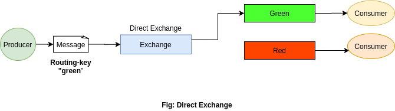
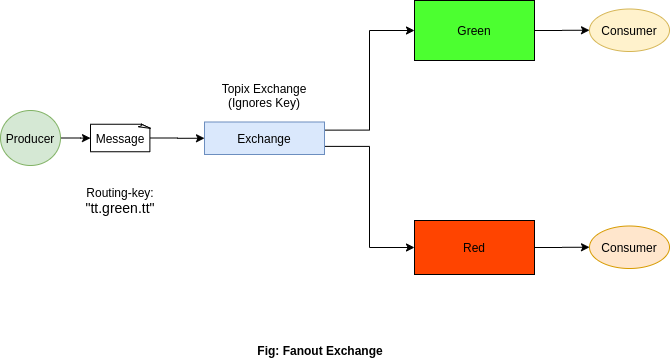
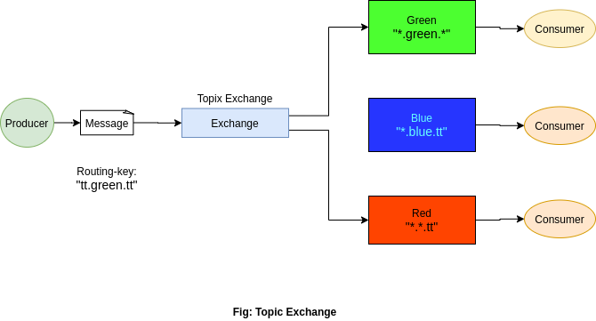

# Publish/Subscribe 
- Deliver a message to multiple consumer.
- Distributed Publisher Subscriber Pattern.
- Demo Example: consist of two programs -- the first will emit log messages and 
the second will receive and print them

## 1. Exchange
- Producer never sends any messages directly to a queue, can only send messages to an exchange.
- Exchange on one side receives messages from producers and the other side it pushes them to queues
- It **must know exactly what to with received messages** from producers and the other side it pushes them to queues.
(**Should it be appended to a particular queue?, Should it be appended to many queues?, or discard**)

- **Exchange Types:** direct, topic, headers and fanout.

    ### 1.1. Direct Exchange
    - Routes messages with a routing key equal to the routing key declared by the binding queue
    
    
    
    ### 1.2. Fanout Exchange
    - Routes messages to all bound queues indiscriminately.
    - If routing key available, ignored.
    
    
    
    ### 1.3. Topic Exchange
    - Routes messages to queues whose routing key matches all, or a portion of a routing key.
    
    
    
    
    
    
    
    